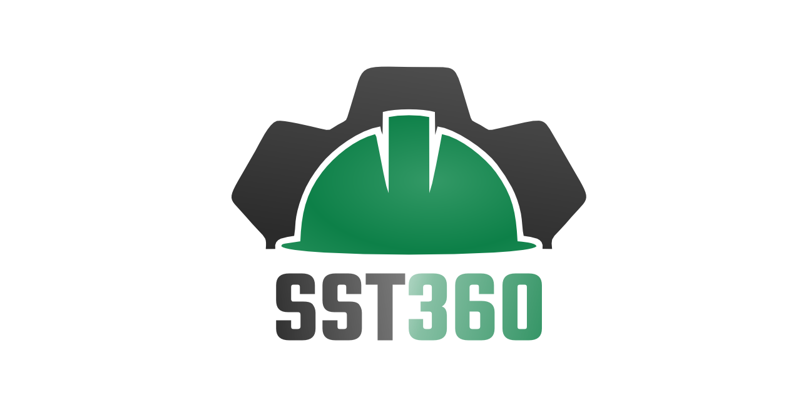

#   

# SST 360 🚑💼⛑️

O **SST 360** é um sistema de gestão de saúde, segurança e meio ambiente (SSMA) desenvolvido para auxiliar na gestão e no acompanhamento das atividades de segurança do trabalho. O sistema foi projetado para facilitar a emissão de permissões de trabalho, o controle de treinamentos, a realização de checklists de segurança e o monitoramento de colaboradores no ambiente de trabalho.

## Índice 📚
- [Sobre](#sobre)
- [Instalação](#instalação)
- [Uso](#uso)
- [Contribuição](#contribuição)
- [Licença](#licença)

## Sobre 🧐

O **SST 360** tem como objetivo oferecer uma plataforma para:
- **Emissão de permissões de trabalho**: 🔐 Permitindo o controle e acompanhamento das atividades realizadas no ambiente de trabalho.
- **Gestão de treinamentos**: 🎓 Acompanhando o status de treinamentos realizados por colaboradores, garantindo que estejam sempre atualizados.
- **Checklists de segurança**: ✅ Facilitando a elaboração e o preenchimento de checklists de segurança para monitoramento das condições de trabalho.
- **Acompanhamento de colaboradores**: 👷‍♂️👷‍♀️ Monitorando a saúde e a segurança dos colaboradores, garantindo um ambiente de trabalho mais seguro e eficiente.

O sistema é voltado para empresas que buscam otimizar seus processos de SSMA e garantir conformidade com as regulamentações de segurança do trabalho.

## Instalação ⚙️

Para instalar e rodar o **SST 360** localmente, siga os passos abaixo:

### 1. Clone o repositório:
```bash
git clone https://github.com/thejappa89/sst360.git
```

### 2. Navegue até o diretório do projeto:
```bash
cd sst360
```

### 3. Instale as dependências (dependendo das tecnologias utilizadas):
Se o projeto for baseado em Node.js, por exemplo:
```bash
npm install
```

Se for Python:
```bash
pip install -r requirements.txt
```

### 4. Inicie o servidor (caso seja uma aplicação web):
```bash
npm start
```

Ou, para outras configurações, forneça as instruções de como iniciar o sistema.

## Uso 🖥️

Depois de instalar o sistema, você pode usar o **SST 360** para realizar as seguintes tarefas:

1. **Emissão de permissões de trabalho**: 🔏
   - Acesse a área de permissões de trabalho e crie novas permissões para os colaboradores.
   
2. **Gestão de treinamentos**: 🎓
   - Acesse a seção de treinamentos e visualize o status de treinamentos dos colaboradores.
   
3. **Checklists de segurança**: 📋
   - Crie e preencha checklists de segurança para garantir que as condições de trabalho estejam seguras.

4. **Acompanhamento de colaboradores**: 👷‍♀️👷‍♂️
   - Monitore a saúde e segurança dos colaboradores, verificando seu histórico e atividades realizadas.

### Exemplos de uso:
- **Exemplo 1**: Como emitir uma permissão de trabalho:
   ```bash
   # Comando ou clique em "Emitir Permissão" no painel do sistema.
   ```

- **Exemplo 2**: Como criar um checklist de segurança:
   ```bash
   # Acesse a página de checklists e preencha as condições de segurança conforme necessário.
   ```

## Contribuição 🤝

Se você deseja contribuir para o desenvolvimento do **HealthSafe**, siga os seguintes passos:

1. Faça o fork deste repositório.
2. Crie uma branch com a sua feature:
   ```bash
   git checkout -b feature/nome-da-feature
   ```
3. Faça as modificações e adicione os commits:
   ```bash
   git commit -am 'Adicionando nova feature'
   ```
4. Envie para o repositório original:
   ```bash
   git push origin feature/nome-da-feature
   ```
5. Abra um Pull Request com uma descrição clara sobre as mudanças realizadas.

## Licença 📄

Este projeto está licenciado sob a **Licença MIT**. Veja o arquivo [LICENSE](LICENSE) para mais detalhes.